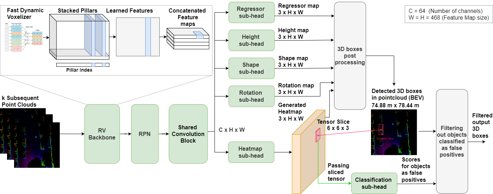

# Official Pytorch implementation for the paper: "RVCDet: Rethinking Voxelization and Classification for 3D Object Detection" [ICONIP-2022]  
 

### RVCDet pipeline:

### RVCDet Demo:

## NEWS:
[14-04-2023] RVCDet [paper](https://link.springer.com/chapter/10.1007/978-981-99-1645-0_39) is available on Springer.  
[23-11-2022] RVCDet [presentation](https://www.youtube.com/watch?v=rYe0wzTdmt4) at The 29th International Conference on Neural Information Processing.  
[13-09-2022] RVCDet is accepeted at [ICONIP 2022](https://iconip2022.apnns.org/)  

## Abstract:
The main challenge in 3D object detection from LiDAR point clouds is achieving real-time performance without affecting the reliability of the network. In other words, the detecting network must be enough confident about its predictions.
In this paper, we present a solution to improve network inference speed and precision at the same time by implementing a fast dynamic voxelizer that works on fast pillar-based models in the same way a voxelizer works on slow voxel-based models. In addition, we propose a lightweight detection sub-head model for classifying predicted objects and filter out false detected objects that significantly improves model precision in a negligible time and computing cost.

## Main Results:
| Model  | Range | mAP/L1 | mAPH/L1 | mAP/L2 | mAPH/L2 | Latency |
|:------:|:-----:|:------:|:-------:|:------:|:-------:|:-------:|
| RVDet          | PerType    | 0.7287 | 0.7095  | 0.6721 | 0.6541 | 43 ms  |
| no ground      | [0, 30)    | 0.8266 | 0.8075  | 0.8075 | 0.7888 |        |
|                | [30, 50)   | 0.6969 | 0.6775  | 0.6465 | 0.6283 |        |
|                | [50, +inf) | 0.5721 | 0.5530  | 0.4863 | 0.4694 |        |
| RVDet          | PerType    | 0.7374 | 0.7176  | 0.6807 | 0.6621 | 47 ms  |
|                | [0, 30)    | 0.8323 | 0.8129  | 0.8134 | 0.7945 |        |
|                | [30, 50)   | 0.7065 | 0.6875  | 0.6558 | 0.6379 |        |
|                | [50, +inf) | 0.5840 | 0.5612  | 0.4974 | 0.4772 |        |

## Use RVCDet:
Follow the provided steps to reproduce our results on Waymo validation and test sets.

Please refer to [INSTALL](/docs/INSTALL.md) to run the docker container for RVCDet.
For training and testing on Waymo, please follow the instructions in [START](/docs/START.md).

## Lisence
RVCDet is released under MIT license (see [LICENSE](LICENSE)). It is developed based on a forked version of [FMFNet](https://github.com/YoushaaMurhij/FMFNet) based-on [CenterPoint](https://github.com/tianweiy/CenterPoint).

## Contact
Questions and suggestions are welcome! 

Youshaa Murhij [yosha[dot]morheg[at]phystech[dot]edu](mailto:)  
Alexander Golodkov [golodkov[dot]ao[at]phystech[dot]edu](mailto:)  
Dmitry Yudin [yudin[dot]da[at]mipt[dot]ru](mailto:) 
