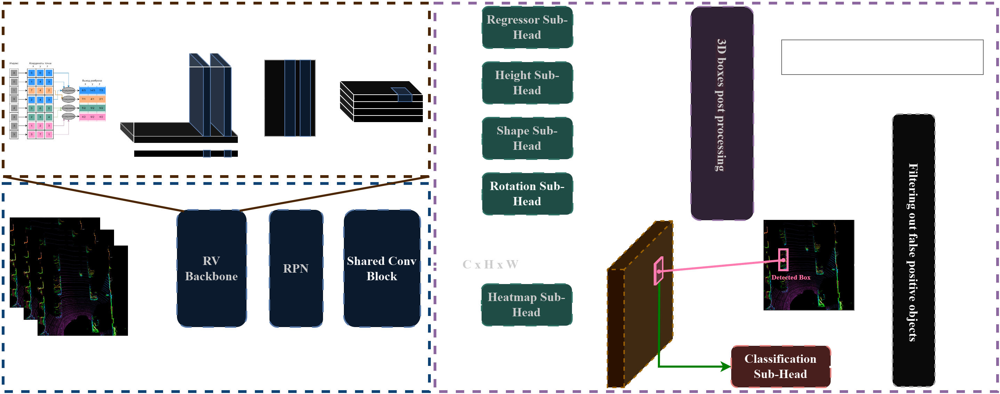

# Official Pytorch implementation for the paper: "RVCDet: Rethinking Voxelization and Classification for 3D Object Detection" [Accepted in ICONIP-2022]  
  

### RVCDet pipeline:

## NEWS: :boom:
- RVCDet is accepeted at ICONIP 2022 :smiley:

## Abstract:
The main challenge in 3D object detection from LiDAR point clouds is achieving real-time performance without affecting the reliability of the network. In other words, the detecting network must be enough confident about its predictions.
In this paper, we present a solution to improve network inference speed and precision at the same time by implementing a fast dynamic voxelizer that works on fast pillar-based models in the same way a voxelizer works on slow voxel-based models. In addition, we propose a lightweight detection sub-head model for classifying predicted objects and filter out false detected objects that significantly improves model precision in a negligible time and computing cost.

## Main Results:
To be updated!

## Use RVCDet:
Follow the provided steps to reproduce our results on Waymo validation and test sets.

Please refer to [INSTALL](/docs/INSTALL.md) to run the docker container for RVCDet.
For training and testing on Waymo, please follow the instructions in [START](/docs/START.md).

## Lisence
RVCDet is released under MIT license (see [LICENSE](LICENSE)). It is developed based on a forked version of [FMFNet](https://github.com/YoushaaMurhij/FMFNet) based-on [CenterPoint](https://github.com/tianweiy/CenterPoint).

## Contact
Questions and suggestions are welcome! 

Youshaa Murhij [yosha[dot]morheg[at]phystech[dot]edu](mailto:)  
Alexander Golodkov [golodkov[dot]ao[at]phystech[dot]edu](mailto:)  
Dmitry Yudin [yudin[dot]da[at]mipt[dot]ru](mailto:) 
